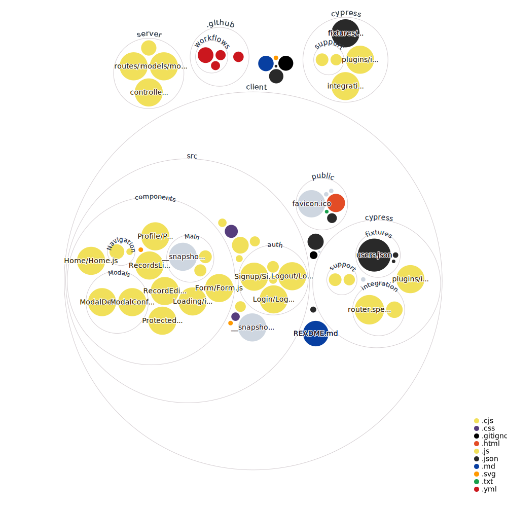

 

# Registration form & Data Records

MERN app with CRUD functionality, Auth0 single sign-on and authentication deployed to Heroku:

[Demo](https://reggg-form.herokuapp.com/)

# <b>Built with</b>:
- [MongoDB](https://www.mongodb.com/)
- [Express](https://expressjs.com/)
- [React](https://reactjs.org)
- [Node.js](https://nodejs.org)

<b>Packages frontend</b>:
- [axios](https://www.npmjs.com/package/axios)
- [moment](https://www.npmjs.com/package/moment)
- [auth0](https://github.com/auth0/auth0-react)
- <b>Styling</b>:
  - [bootstrap](https://www.npmjs.com/package/bootstrap)
  - [react-bootstrap]( https://react-bootstrap.github.io/)
  - [mdb react]( https://mdbootstrap.com/docs/react/)
  
  
 
<b>Packages backend</b>:
- [mongoose](https://www.npmjs.com/package/mongoose)
- [cors](https://www.npmjs.com/package/cors)
- [lodash.debounce](https://www.npmjs.com/package/lodash.debounce)
- [path](https://www.npmjs.com/package/path)
- [body-parser](https://www.npmjs.com/package/body-parser)
- <b>Authentication</b>:
  - [express-jwt](https://github.com/auth0/express-jwt)
  - [jwks-rsa](https://github.com/auth0/node-jwks-rsa)

<b>Database</b>
- [MongoDB](https://www.mongodb.com/)

<b>Testing</b>
- [Jest](https://jestjs.io/)
- [React Testing Library](https://testing-library.com/docs/react-testing-library/intro/)
- [Cypress](https://cypress.io/)

